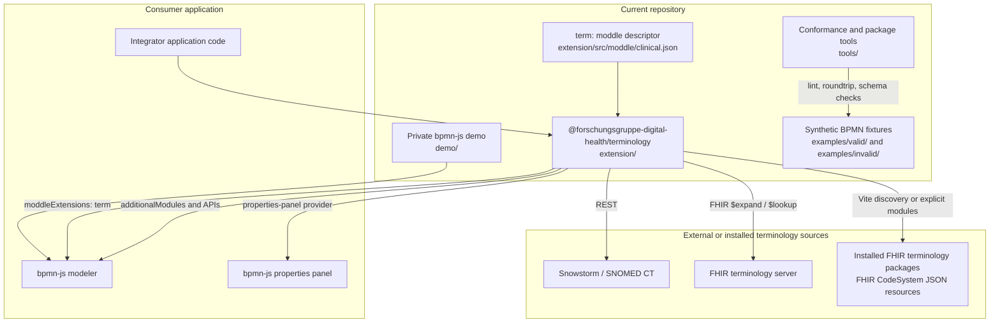

# 3. Context and Scope

_Defines system boundaries, external interfaces, and what is inside versus
outside the extension._

## Technical context

### In scope

- The `term:` BPMN moddle descriptor and `clinical-semantics.xsd`.
- `TerminologyProvider`, `TerminologyRegistry`, adapters, providers, presets,
  package-backed CodeSystem loading, and default service configuration.
- The bpmn-js properties-panel provider and annotation helper operations.
- The Vite plugin that exposes selected installed FHIR terminology resources.
- The private demo and synthetic fixtures used to exercise integration.
- Deterministic conformance and package checks.

### Out of scope

- A BPMN editor or runtime engine; bpmn-js is supplied by the host.
- Operation of Snowstorm or any FHIR terminology server.
- Authoritative maintenance or licensing of external terminology content.
- A second custom BPMN extension namespace or an additional persistence model.
- Patient records, clinical workflow execution, or production hosting.

## External interfaces

| Partner | Relationship | Channel / operation | Extension entry point |
|---|---|---|---|
| Host bpmn-js modeler | In-process | `additionalModules`, `moddleExtensions`, `importXML`, `saveXML` | `extension/src/index.js`; `demo/src/app.js` |
| Host properties panel | In-process | Provider registration and modeling commands | `extension/src/properties-panel/TerminologyPropertiesProvider.js` |
| Snowstorm | Outbound, optional | REST search, lookup, hierarchy | `extension/src/adapters/SnowstormAdapter.js` |
| FHIR terminology server | Outbound, optional | FHIR `$expand` and `$lookup` | `extension/src/adapters/FhirTerminologyAdapter.js` |
| FHIR terminology package | Installed build-time resource | JSON `CodeSystem` resources selected by URL | `extension/src/vite/plugin.js`; `extension/src/services/PackageProviderDiscovery.js` |
| GitHub Packages | Distribution | npm publish/install | `extension/package.json`; `.github/workflows/publish.yml` |
| GitHub Pages | Demo distribution | Static HTTPS site | `.github/workflows/pages.yml`; `demo/` |

Business actors, institutional terminology governance, and service-level
agreements are not defined by this repository.

---

[← Architecture index](../ARCHITECTURE.md) · [Previous](02_architecture_constraints.md) · [Next →](04_solution_strategy.md)
