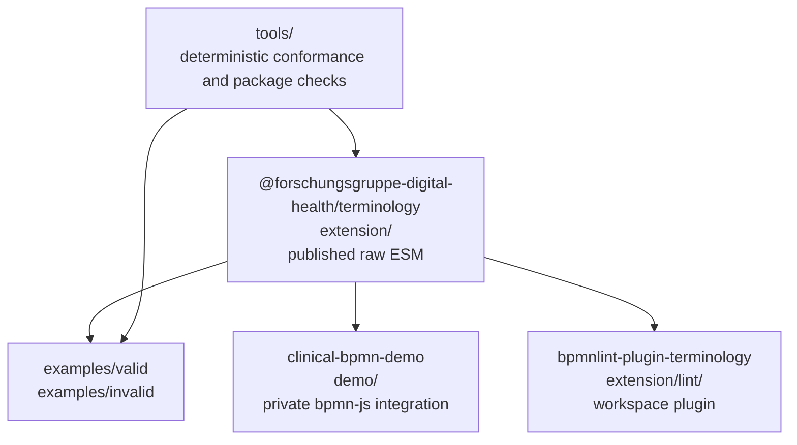
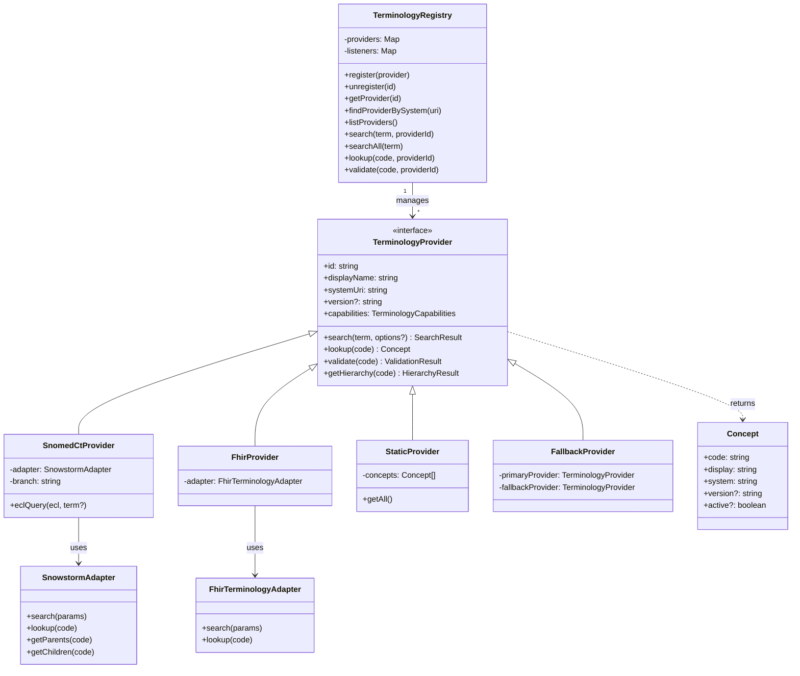

# 5. Building Block View

_Shows the static decomposition into packages, modules, and key runtime
components._

## Level 1: repository building blocks



## Terminology provider architecture



## Level 2: published package

```text
extension/
├── src/index.js                         public ESM exports
├── src/core/
│   ├── TerminologyProvider.js            provider contract
│   ├── TerminologyRegistry.js            provider facade
│   ├── types.js                          JSDoc types and constants
│   └── fhir-version.js                   active FHIR version metadata
├── src/adapters/
│   ├── SnowstormAdapter.js               SNOMED CT REST transport
│   └── FhirTerminologyAdapter.js         FHIR $expand/$lookup transport
├── src/providers/
│   ├── SnomedCtProvider.js
│   ├── FhirProvider.js
│   ├── StaticProvider.js
│   ├── FallbackProvider.js
│   └── presets/index.js                  bundled package presets
├── src/services/
│   ├── AnnotationHelper.js               term: object CRUD
│   ├── TerminologyServices.js             service/module factories
│   ├── FhirCodeSystemLoader.js            FHIR CodeSystem loading
│   ├── CodeSystemProviderFactory.js       CodeSystem → provider
│   ├── PackageProviderDiscovery.js        package grouping/filtering
│   ├── TerminologyProviderLoader.js        lazy FHIR provider loading
│   └── PackageMetadata.js                 provider labels and metadata
├── src/config/terminology-config.js       defaults and overrides
├── src/moddle/clinical.json               term: descriptor
├── src/properties-panel/                  bpmn-js editing provider and entries
└── src/vite/                              package discovery plugin
```

### `term:` moddle building block

`extension/src/moddle/clinical.json` declares:

- `Annotations`, an `Element` container with many `Annotation` values.
- `Annotation`, an `Element` with `id`, optional `text`, and many `Coding`
  values.
- `Coding`, an `Element` with `system`, optional `version`, `code`, and
  optional `display` attributes.

The descriptor uses lower-case XML tag aliases. The schema counterpart is
`schema/clinical-semantics.xsd`.

### Properties-panel building block

`TerminologyPropertiesProvider` registers at low priority and contributes the
“Clinical annotations” group for supported tasks, subprocesses, gateways,
events, data references, and other `TARGET_TYPES`. `AnnotationListEntry` edits
`term:Annotations` and `term:Coding` values. `AnnotationHelper` lazily creates
`bpmn:ExtensionElements` and wires `$parent` links before bpmn-js commits the
change through `modeling.updateModdleProperties`.

### Providers and defaults

The default configuration can register:

- SNOMED CT through FHIR or Snowstorm transport.
- FHIR terminology providers for LOINC, ICD-10-GM, OPS, and ATC.
- Package-backed providers for HL7 Terminology R4, IHE XDS class/type codes,
  and KDL.
- Additional static, FHIR, package, or fallback providers supplied by the
  consumer.

---

[← Architecture index](../ARCHITECTURE.md) · [Previous](04_solution_strategy.md) · [Next →](06_runtime_view.md)
