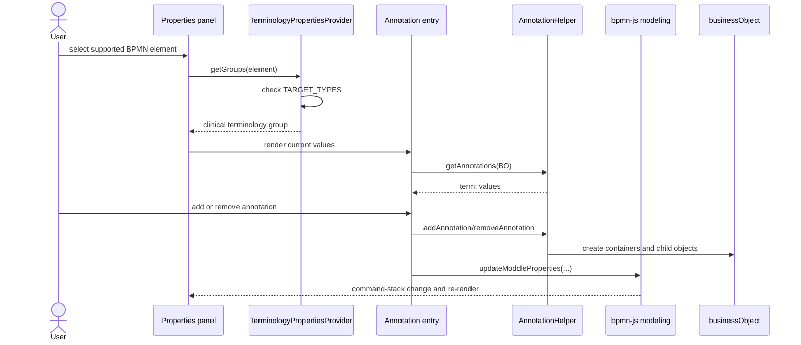

# 6. Runtime View

_Describes important runtime interactions in the host bpmn-js application and
in the conformance tools._

The package has no server or long-running process. Runtime execution occurs
inside a consumer's bpmn-js modeler, while the repository tools execute as
short-lived Node.js processes.

## Scenario 1 — Load an annotated diagram

The host registers the descriptor and imports BPMN XML:

```js
const modeler = new BpmnModeler({
  container: '#canvas',
  additionalModules: [
    createTerminologyPropertiesPanelModule(),
    createDefaultTerminologyModule()
  ],
  moddleExtensions: {
    term: TerminologyModdleDescriptor
  }
});

await modeler.importXML(annotatedBpmn);
```

`bpmn-moddle` materializes `term:Annotations`, `term:Annotation`, and
`term:Coding` values inside `bpmn:extensionElements`. Without the descriptor,
the host cannot provide typed terminology objects; the conformance roundtrip
tool reports parse warnings for unknown content.

## Scenario 2 — Select and edit an element



The helper creates `bpmn:ExtensionElements` and `term:Annotations` lazily.
Created objects receive `$parent` links. bpmn-js therefore owns undo/redo and
serialization rather than the entry component mutating XML directly.

## Scenario 3 — Serialize and check a roundtrip

The demo uses `modeler.saveXML({ format: true })` for its XML preview and
download. The conformance tool performs the same operation without a modeler:

1. Discover `.bpmn` files under `examples/valid/` and `docs/`.
2. Parse each file with `term` registered.
3. Serialize to XML A.
4. Parse A and serialize again to XML B.
5. Require A and B to be identical.
6. Compare `<term:...>` element counts to detect dropped extension elements.
7. Report parse warnings; `--strict` promotes warnings to failures.

The command is `npm run check:roundtrip`, and it is part of
`npm run check:conformance` and `npm run verify`.

## Scenario 4 — Search terminology

Integrator code calls the registry:

```js
const result = await terminologyRegistry.search('pneumonia', 'snomed-ct');
const concept = await terminologyRegistry.lookup('169069000', 'snomed-ct');
```

The registry delegates to the selected provider. `SnomedCtProvider` uses
Snowstorm or the configured FHIR transport; `FhirProvider` uses FHIR
`$expand`/`$lookup`; `StaticProvider` searches in-memory concepts. Package
providers are built from FHIR `CodeSystem` resources and preserve each
resource's canonical URL in returned concepts.

## Scenario 5 — Discover package-backed CodeSystems

The bundled HL7 preset imports its generated CodeSystem module directly and
does not depend on Vite APIs. The Vite plugin remains an optional build-time
path for additional consumer-selected packages: it finds selected
`CodeSystem` JSON resources, filters them by exact canonical `CodeSystem.url`,
and exposes a virtual module and optional global. The default service factory
groups discovered resources by package, creates one provider per package, and
combines those providers with the built-in defaults. Explicit
`include`/`exclude` settings fail fast when a configured canonical URL does not
exist.

## Error and edge behavior

- Provider registration rejects duplicate provider IDs.
- Registry lookup of an unknown provider reports the available IDs.
- Adapter failures are propagated to the caller; production retry,
  authentication, and availability policy belong to the host application.
- A missing package CodeSystem can cause a preset to be skipped or discovery
  to report a configuration error.
- The demo catches import/bootstrap failures and logs them; it does not define
  a production error UI.

---

[← Architecture index](../ARCHITECTURE.md) · [Previous](05_building_block_view.md) · [Next →](07_deployment_view.md)
