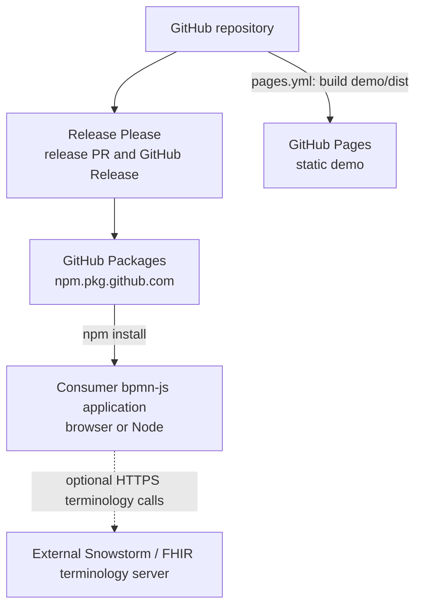

# 7. Deployment View

_Describes distribution and execution environments. This repository publishes
a library; it does not operate a backend service._

## Distribution topology

## Distributed artifacts

| Artifact | Location/name | Distribution |
|---|---|---|
| Terminology library | `extension/`, `@forschungsgruppe-digital-health/terminology` | Published as raw ESM to GitHub Packages |
| Terminology lint plugin | `extension/lint/bpmnlint-plugin-terminology` | Workspace support for repository linting |
| Demo application | `demo/`, `clinical-bpmn-demo` | Private workspace; built to `demo/dist` and deployed to GitHub Pages |
| BPMN fixtures | `examples/valid/`, `examples/invalid/` | Repository test/conformance inputs |
| Schema | `schema/clinical-semantics.xsd` | Repository artifact; generated from the moddle descriptor |

The package exports its source, moddle JSON, properties-panel module and CSS,
Vite plugin, and public type declarations through `extension/package.json`.
The consumer supplies bpmn-js and properties-panel peer dependencies.

## Release and publication

`release-please.yml` runs on pushes to `main` and maintains the release PR.
`release-please-config.json` tracks the `extension` component and updates the
lint plugin version, descriptor version, and XSD. The `include-component-in-tag`
setting produces a component-qualified release tag.

`publish.yml` runs on `release: published`, authenticates with the workflow
token, installs with `npm ci --legacy-peer-deps`, and publishes the
`extension` workspace. It does not build the library first and skips an
already-published version on rerun.

## Demo deployment

`pages.yml` runs on pushes to `main`, tests with Node 22, builds the private
`demo` workspace using Vite, uploads `demo/dist`, and deploys it to GitHub
Pages. The demo imports synthetic BPMN samples from `examples/valid/` and uses
the extension's default terminology services.

## Execution environments

| Environment | What runs | Operator |
|---|---|---|
| GitHub Actions | validation, conformance, release, publication, demo build | project |
| GitHub Packages | published npm package | project/integrators |
| GitHub Pages | static demo assets | project |
| Consumer host | bpmn-js, extension modules, and optional terminology calls | integrator |
| Snowstorm/FHIR server | optional terminology operations | consumer or third party |

There is no Docker, Kubernetes, database, message broker, or application server
in this repository. Hosting, scaling, credentials, and availability targets for
a consuming application require human input.

---

[← Architecture index](../ARCHITECTURE.md) · [Previous](06_runtime_view.md) · [Next →](08_crosscutting_concepts.md)
