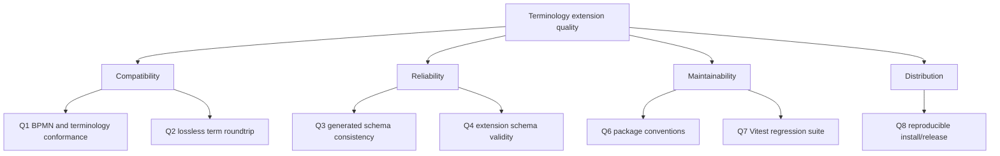

# 10. Quality Requirements

_Defines the quality properties that are enforced or explicitly supported by
the current repository._

## 10.1 Quality goals and evidence

| ID | Goal | Evidence | Blocking behavior |
|---|---|---|---|
| Q1 | BPMN structural and terminology conformance | `npm run lint:bpmn`, `.bpmnlintrc`, `tools/lint-bpmn.mjs` | Fails on lint errors |
| Q2 | Lossless, stable `term:` serialization | `tools/moddle-roundtrip.mjs` | Fails on non-idempotence or dropped extension elements |
| Q3 | Generated schema consistency | `npm run xsd:gen:check` | Fails when generated XSD differs |
| Q4 | Extension-schema validity | `npm run xsd:ext` | Fails on extension schema errors |
| Q5 | BPMN core XSD compatibility | `npm run check:xsd` | Informational by default; strict mode is available |
| Q6 | Publishable package conventions | `npm run check:packages` | Fails on invalid name, ESM, license, or entry point |
| Q7 | Regression correctness | `npm test` / Vitest | Fails on test failures |
| Q8 | Reproducible installation and release checks | lockfile, `npm ci --legacy-peer-deps`, workflows, hooks | CI and local gates use the same scripts |

The aggregate commands are:

```text
npm run check:conformance
npm run verify
```

The standard BPMN XSD accepts arbitrary content in `extensionElements`, so a
successful core-XSD result does not validate `term:` semantics. Moddle
roundtrip and the generated extension XSD provide that extension-specific
coverage.

## Quality tree



This tree records relationships visible in the tooling, not stakeholder
weights.

## 10.2 Quality scenarios

### Q1 — Invalid BPMN structure

When a contributor runs `npm run lint:bpmn` or the validation workflow scans a
fixture, bpmnlint checks the discovered BPMN files and returns a non-zero exit
for structural or configured terminology errors.

### Q2 — Unstable or lossy serialization

When a `.bpmn` file containing `term:` elements is round-tripped, the tool
requires serialization A to equal serialization B and requires the number of
`term:` elements not to decrease. Instability or loss is blocking; parse
warnings are non-fatal unless `--strict` is used.

### Q3 — Descriptor or generated-schema drift

When the moddle descriptor changes, `xsd:gen:check` compares the generated
schema with the committed `schema/clinical-semantics.xsd`. Drift fails the
conformance command.

### Q4 — Package convention regression

When `extension/package.json` or release artifacts are changed,
`check:packages` verifies the accepted package name, ESM mode, license, entry
point, and recommended publishing metadata.

### Q5 — Test regression

When a pull request or push is validated, the Node 22 workflow runs the
extension Vitest suite and builds the demo after the tests pass.

## 10.3 Targets requiring human input

The repository does not set quantitative targets for:

- terminology request latency, throughput, retries, or maximum model size;
- availability and authentication requirements for external terminology servers;
- properties-panel accessibility, localization, or usability levels;
- coverage thresholds beyond the existing Vitest suite;
- third-party BPMN-tool preservation behavior;
- stakeholder weighting between compatibility, feature scope, and maintenance.

---

[← Architecture index](../ARCHITECTURE.md) · [Previous](09_architecture_decisions.md) · [Next →](11_risks_and_technical_debt.md)
